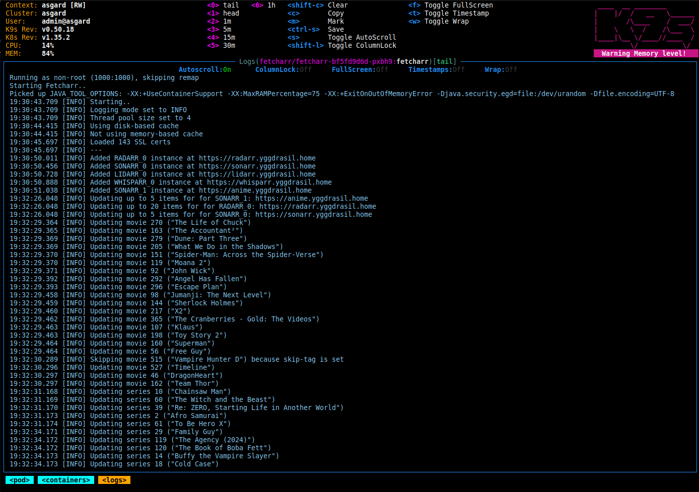

# Fetcharr


###### Icon is LLM-generated and temporary until one from an artist can be sourced.



## What is it?

Since Huntarr died, I still needed an application that scanned and upgraded my media.
I tried a few different projects but I didn't like any of them for various reasons.

Since vibe-coding is a big deal these days, I decided to brush off my Java rust and try my hand at
a containerized project that used configuration similar to Unpackerr and did one thing and did it well.
The few portions with LLM assistance have been noted (search `ChatGPT`) and generated code was read and verified before use.

No use of opencode, claude code, cursor, etc in this project. Any LLM assistance was done via web UI.
Largely to ask questions about design, errors, or specific details I've forgotten since touching Java.
Readme also written by hand.

I think I hit that nail on the head.

Currently supports the following:
- Radarr
- Sonarr
- Lidarr
- Whisparr

### Huntarr? What?

[The Huntarr saga](https://www.reddit.com/r/selfhosted/comments/1rckopd/huntarr_your_passwords_and_your_entire_arr_stacks/) is an interesting one
if you're curious, but if you're not familiar with the history then here's the short of what Fetcharr does:

The idea is that you’ll occasionally want to go through all your media and make sure it’s the best quality available and that nothing’s missing.
New releases get published, remuxes sometimes fix issues, etc. This little CLI container goes through and periodically searches every *arr app you connect
it to, so you don’t have to sacrifice hours of your weekend doing (as much) manual hunting.

Now, it's worth mentioning that Sonarr, Radarr, etc have had a built-in system that does this for a while now, but I've never gotten
them to work reliably. Maybe it's just bad luck or some strange misconfiguration, but I've always had a need for apps like
Scoutarr (Upgradinatorr), Huntarr, etc. Considering the popularity of these apps it feels like I am not the only one.

Update to this: I learned that at *arr stack uses RSS feeds to scan for and fetch updates, so if your indexer doesn't support those
feeds or the feeds or too old (or a myriad of other issues that can come from this kind of system) then you won't get replacement content
even if it exists. This is why these kinds of "hunting", "fetching", "upgrading", etc systems work so well. They simply force the *arr
apps to periodically update their content through their configured indexer, regardless of RSS feed availability.

If the concept sounds interesting to you, give Fetcharr a try. See if it finds anything. If my experience while developing this is anything
to go by, you'll get some results almost immediately. Likely within a few hours, and maybe even within a few seconds. See if it helps
and if you want to add it to your stack.

## How do I use it?

Docker, Kubernetes, whatever container system you currently use. Use the `latest` tag for the latest production build or
the `dev` tag for the latest development build.

Or by immutable tag: https://hub.docker.com/r/egg82/fetcharr/tags

Also available on GitHub: https://github.com/users/egg82/packages/container/package/fetcharr

<details open>
<summary>Docker</summary>

```bash
docker run \
  -e VERIFY_CERTS=true \
  -e SSL_PATH=/etc/ssl/certs/ca-bundle.crt \
  -e SEARCH_AMOUNT=5 \
  -e SEARCH_INTERVAL=1hour \
  -e RADARR_0_URL=https://radarr.home.lab \
  -e RADARR_0_API_KEY=e8ea891d72ff973fa6db0d34369a60a7 \
  -e SONARR_0_URL=https://sonarr.home.lab \
  -e SONARR_0_API_KEY=71730b5dfaa4293fe0c050844c10df66 \
  -e SONARR_1_URL=https://anime.home.lab \
  -e SONARR_1_API_KEY=bdb84dc8e4b787c76be8aae2dfe9bd19 \
  -v ./config:/app/config \
  -v ./cache:/app/cache \
  -v ./logs:/app/logs \
  -v ./plugins:/app/plugins \
  egg82/fetcharr:latest
```
</details>

<details>
<summary>Docker Compose</summary>

```dockerfile
services:
  fetcharr:
    image: egg82/fetcharr:latest
    container_name: fetcharr
    hostname: fetcharr
    environment:
      - VERIFY_CERTS=true
      - SSL_PATH=/etc/ssl/certs/ca-bundle.crt
      - SEARCH_AMOUNT=5
      - SEARCH_INTERVAL=1hour
      - RADARR_0_URL=https://radarr.home.lab
      - RADARR_0_API_KEY=e8ea891d72ff973fa6db0d34369a60a7
      - SONARR_0_URL=https://sonarr.home.lab
      - SONARR_0_API_KEY=71730b5dfaa4293fe0c050844c10df66
      - SONARR_1_URL=https://anime.home.lab
      - SONARR_1_API_KEY=bdb84dc8e4b787c76be8aae2dfe9bd19
    volumes:
      - ./config:/app/config
      - ./cache:/app/cache
      - ./logs:/app/logs
      - ./plugins:/app/plugins
    restart: unless-stopped
```
</details>

<details>
<summary>Kubernetes</summary>

```yaml
apiVersion: v1
kind: Namespace
metadata:
  name: fetcharr
---
apiVersion: v1
kind: PersistentVolumeClaim
metadata:
  name: config
  namespace: fetcharr
spec:
  accessModes:
    - ReadWriteMany
  resources:
    requests:
      storage: 1Gi
---
apiVersion: v1
kind: PersistentVolumeClaim
metadata:
  name: cache
  namespace: fetcharr
spec:
  accessModes:
    - ReadWriteMany
  resources:
    requests:
      storage: 5Gi
---
apiVersion: v1
kind: PersistentVolumeClaim
metadata:
  name: logs
  namespace: fetcharr
spec:
  accessModes:
    - ReadWriteMany
  resources:
    requests:
      storage: 10Gi
---
apiVersion: v1
kind: PersistentVolumeClaim
metadata:
  name: plugins
  namespace: fetcharr
spec:
  accessModes:
    - ReadWriteMany
  resources:
    requests:
      storage: 5Gi
---
apiVersion: apps/v1
kind: Deployment
metadata:
  labels:
    app.kubernetes.io/name: fetcharr
  name: fetcharr
  namespace: fetcharr
spec:
  replicas: 1
  selector:
    matchLabels:
      app.kubernetes.io/name: fetcharr
  template:
    metadata:
      labels:
        app.kubernetes.io/name: fetcharr
    spec:
      securityContext:
        fsGroup: 1000
        fsGroupChangePolicy: OnRootMismatch
        seccompProfile:
          type: RuntimeDefault
      containers:
        - image: egg82/fetcharr:<use-real-version>
          name: fetcharr
          securityContext:
            runAsUser: 1000
            runAsGroup: 1000
            allowPrivilegeEscalation: false
            runAsNonRoot: true
            capabilities:
              drop: ["ALL"]
          resources:
            requests:
              cpu: 50m
              memory: 150Mi
            limits:
              cpu: 500m
              memory: 1Gi
          env:
            - name: VERIFY_CERTS
              value: "true"
            - name: SSL_PATH
              value: /etc/ssl/certs/ca-bundle.crt
            - name: SEARCH_AMOUNT
              value: "5"
            - name: SEARCH_INTERVAL
              value: 1hour
            - name: RADARR_0_URL
              value: https://radarr.home.lab
            - name: RADARR_0_API_KEY
              value: e8ea891d72ff973fa6db0d34369a60a7
            - name: SONARR_0_URL
              value: https://sonarr.home.lab
            - name: SONARR_0_API_KEY
              value: 71730b5dfaa4293fe0c050844c10df66
            - name: SONARR_1_URL
              value: https://anime.home.lab
            - name: SONARR_1_API_KEY
              value: bdb84dc8e4b787c76be8aae2dfe9bd19
          volumeMounts:
            - mountPath: /app/config
              name: config
            - mountPath: /app/cache
              name: cache
            - mountPath: /app/logs
              name: logs
            - mountPath: /app/plugins
              name: plugins
      volumes:
        - name: config
          persistentVolumeClaim:
            claimName: config
        - name: cache
          persistentVolumeClaim:
            claimName: cache
        - name: logs
          persistentVolumeClaim:
            claimName: logs
        - name: plugins
          persistentVolumeClaim:
            claimName: plugins
```
</details>

## Environment variables

### Common

| variable | type    | values | default  | description |
| -------- |---------| ------ |----------| ----------- |
| PUID | int | 0-65535 | 1000 | Process UID override, eg. Unraid would be 99 |
| PGID | int | 0-65535 | 1000 | Process GID override, eg. Unraid would be 100 |
| LOG_MODE | string | trace, debug, info, warn, error | info | Logging mode |
| DRY_RUN | boolean | true, false | false | Run in dry-run mode, which will list (but **not** perform) searches |
| CONFIG_DIR | directory | /any/directory/path | /app/config | Configuration storage directory |
| CACHE_DIR | directory | /any/directory/path | /app/cache | Cache storage directory |
| LOG_DIR | directory | /any/directory/path | /app/logs | Log storage directory |
| VERIFY_CERTS | boolean | true, false | true | Verify SSL certificates |
| SSL_PATH | file | /any/file/path.ext | /etc/ssl/certs/ca-bundle.crt | File path for SSL cert bundle |
| PROXY_HOST | string | \<URL\> | \<none\> | HTTP proxy host |
| PROXY_PORT| integer | 1-65534 | 80 | HTTP proxy port |
| CONNECT_TIMEOUT | integer | 0-2147483647 | 2500 | HTTP connection timeout in milliseconds |
| REQUEST_TIMEOUT | integer | 0-2147483647 | 120000 | HTTP request timeout in milliseconds |
| CONNECT_TTL | integer | 0-2147483647 | 300000 | HTTP connection TTL in milliseconds |
| USE_FILE_CACHE | tristate | auto, true, false | auto | Use file-based cache |
| USE_MEMORY_CACHE | tristate | auto, true, false | auto | Use in-memory cache |
| SHORT_CACHE_TIME | time | 5minutes, 3hours, 1day, etc | 65minutes | Expiration time for short-lived cached values |
| LONG_CACHE_TIME | time | 5minutes, 3hours, 1day, etc | 6hours | Expiration time for long-lived cached values |
| SEARCH_AMOUNT | integer | 0-2147483647 | 5 | Number of items to search at each run |
| SEARCH_INTERVAL | time | 5minutes, 3hours, 1day, etc | 1hour | How often to perform searches |
| MONITORED_ONLY | boolean | true, false | true | Select for monitored items |
| MISSING_ONLY | boolean | true, false | false | Select for missing items |
| USE_CUTOFF | boolean | true, false | false | Select for items that do not meet their profile cutoff |
| SKIP_TAGS | string | any,string,values | \<none\> | Comma-separated list of tags to skip searching |

Notes on caching:

With `USE_FILE_CACHE` set to "auto", Fetcharr will determine if the configured cache directory is writable.
If so, it will enable use of file caching. If not, it will disable file caching.

With `USE_MEMORY_CACHE` set to "auto", Fetcharr will determine if the file cache is usable.
If so, it will disable use of in-memory caching. If not, it will enable in-memory caching.

This means that, if file caching is available, it won't store cached objects in memory. If file caching is
not available, cached objects will be stored in memory. In-memory caching can consume a fair amount of memory,
so file caching is preferred when possible.

It's also possible to disable both so no caching is performed at all. Obviously, if you're using purely in-memory
caching and you restart the container your cache will be lost.

Since caching is just that - caching - then clearing or disabling the cache won't really affect the program
except to cause more API calls and a slightly slower run. Depending on your setup either tradeoff can be
perfectly acceptable. This is why there's configuration options, eh?

### Radarr overrides

Replace `X` with a number from 0 to 99. This allows for up to 100 instances to be configured.

| variable | type    | values | default  | description |
| -------- |---------| ------ |----------| ----------- |
| RADARR_X_URL | string | \<URL\> | \<none\> | Base URL |
| RADARR_X_API_KEY | string | \<key\> | \<none\> | API key |
| RADARR_X_SEARCH_AMOUNT | integer | 0-2147483647 | 5 | Number of items to search at each run |
| RADARR_X_SEARCH_INTERVAL | time | 5minutes, 3hours, 1day, etc | 1hour | How often to perform searches |
| RADARR_X_MONITORED_ONLY | boolean | true, false | true | Select for monitored items |
| RADARR_X_MISSING_ONLY | boolean | true, false | false | Select for missing items |
| RADARR_X_USE_CUTOFF | boolean | true, false | false | Select for items that do not meet their profile cutoff |
| RADARR_X_SKIP_TAGS | string | any,string,values | \<none\> | Comma-separated list of tags to skip searching |

### Sonarr overrides

Replace `X` with a number from 0 to 99. This allows for up to 100 instances to be configured.

| variable | type    | values | default  | description |
| -------- |---------| ------ |----------| ----------- |
| SONARR_X_URL | string | \<URL\> | \<none\> | Base URL |
| SONARR_X_API_KEY | string | \<key\> | \<none\> | API key |
| SONARR_X_SEARCH_AMOUNT | integer | 0-2147483647 | 5 | Number of items to search at each run |
| SONARR_X_SEARCH_INTERVAL | time | 5minutes, 3hours, 1day, etc | 1hour | How often to perform searches |
| SONARR_X_MONITORED_ONLY | boolean | true, false | true | Select for monitored items |
| SONARR_X_MISSING_ONLY | boolean | true, false | false | Select for missing items |
| SONARR_X_USE_CUTOFF | boolean | true, false | false | Select for items that do not meet their profile cutoff |
| SONARR_X_SKIP_TAGS | string | any,string,values | \<none\> | Comma-separated list of tags to skip searching |

### Lidarr overrides

Replace `X` with a number from 0 to 99. This allows for up to 100 instances to be configured.

| variable | type    | values | default  | description |
| -------- |---------| ------ |----------| ----------- |
| LIDARR_X_URL | string | \<URL\> | \<none\> | Base URL |
| LIDARR_X_API_KEY | string | \<key\> | \<none\> | API key |
| LIDARR_X_SEARCH_AMOUNT | integer | 0-2147483647 | 5 | Number of items to search at each run |
| LIDARR_X_SEARCH_INTERVAL | time | 5minutes, 3hours, 1day, etc | 1hour | How often to perform searches |
| LIDARR_X_MONITORED_ONLY | boolean | true, false | true | Select for monitored items |
| LIDARR_X_MISSING_ONLY | boolean | true, false | false | Select for missing items |
| LIDARR_X_USE_CUTOFF | boolean | true, false | false | Select for items that do not meet their profile cutoff |
| LIDARR_X_SKIP_TAGS | string | any,string,values | \<none\> | Comma-separated list of tags to skip searching |

### Whisparr overrides

Replace `X` with a number from 0 to 99. This allows for up to 100 instances to be configured.

| variable | type    | values | default  | description |
| -------- |---------| ------ |----------| ----------- |
| WHISPARR_X_URL | string | \<URL\> | \<none\> | Base URL |
| WHISPARR_X_API_KEY | string | \<key\> | \<none\> | API key |
| WHISPARR_X_SEARCH_AMOUNT | integer | 0-2147483647 | 5 | Number of items to search at each run |
| WHISPARR_X_SEARCH_INTERVAL | time | 5minutes, 3hours, 1day, etc | 1hour | How often to perform searches |
| WHISPARR_X_MONITORED_ONLY | boolean | true, false | true | Select for monitored items |
| WHISPARR_X_MISSING_ONLY | boolean | true, false | false | Select for missing items |
| WHISPARR_X_USE_CUTOFF | boolean | true, false | false | Select for items that do not meet their profile cutoff |
| WHISPARR_X_SKIP_TAGS | string | any,string,values | \<none\> | Comma-separated list of tags to skip searching |

## Plugins

Fetcharr offers plugin support, which allows for customization and extensibility beyond the base application.
This keeps Fetcharr reasonably clean and minimal while still providing an avenue for niche use-cases.

### Plugin/API environment variables

| variable | type    | values | default  | description |
| -------- |---------| ------ |----------| ----------- |
| PLUGIN_DIR | directory | /any/directory/path | /app/plugins | Plugin directory |
| PROVIDE_RAW_API_OBJ | boolean | true, false | false | Provide raw API objects to plugins. Uses more memory |

### Plugin usage

Plugins are `.jar` files that are picked up in the `plugins` directory automatically (controlled via the
`PLUGIN_DIR` environment variable). Plugins are loaded in the natural sort/list order for the directory. This
means that a plugin named `10-my-plugin.jar` will be loaded before `20-alpha-plugin.jar` and
after `00-zzz-plugin.jar`.

Simply dropping the jar files in that directory and starting (or re-starting) Fetcharr will enable
the plugins during Fetcharr's next startup.

To make this easier, Fetcharr can use a `plugins.yaml` in the configuration directory which will download
plugins from specified URLs automatically at startup.

Simply create a `<config-dir>/plugins.yaml` with data similar to the following:
```yaml
plugins:
  - url: https://some.web.domain/some/path/some-plugin-1.0.0.jar
    filename: 01-some-plugin.jar

  - url: https://another.web.domain/another/path/v1.2.3/another-plugin.jar
    filename: 02-another-plugin.jar
    sha256: 396d448073cf44195508216fca8668cfd6ab395bb447a077227b17d521dec80b

  - manifest: https://some.web.domain/whatever/path/manifest.yaml
```

Each item under `plugins` must be one of the following:
- A direct plugin download
  - `url`: the URL of the plugin to download
  - `filename`: the name of the file that will be placed in the plugin directory
  - `sha256`: an optional (but recommended) SHA256 of the jar file
- A manifest reference
  - `manifest`: the URL of another YAML-formatted plugin list

Manifest references are the same format as the above plugin YAML, and may reference other
manifests within them. Recursion! Manifest loops are detected and ignored.

If plugin filenames are duplicated, later entries overwrite earlier ones. In other words, if a later
direct plugin or manifest uses the filename of an existing file, that file will be replaced
(unless the SHA256 matches).

### Plugin development

The Webhook module is an example (usable) plugin utilizing all the available features.

Plugins must have a class implements the `me.egg82.fetcharr.api.plugin.Plugin` interface and
contain a `plugin.yaml` in their resources. The `plugin.yaml` file has a structure similar to the following:
```yaml
id: unique-id
name: Some name
version: Any version number
description: Whatever description
authors: [some, authors]
class: your.package.path.MainClass
exports:
  - another.package.path.to.api
  - maybe.some.path.to.Class
```

Details on each of these:
- `id`: REQUIRED. A unique plugin ID
- `name`: REQUIRED. A friendly name to give to the plugin
- `version`: REQUIRED. Any version string for the plugin
- `description`: Optional. A plugin description, if you'd like to add one
- `authors`: Optional. A list of plugin authors
- `class`: REQUIRED. The main class to load (the one that implements `me.egg82.fetcharr.api.plugin.Plugin`)
- `exports`: Optional. A list of classes or packages to expose to other plugins

<details open>
<summary>Maven</summary>

```xml
<repositories>
  <repository>
    <id>egg82-repo-releases</id>
    <url>https://repo.egg82.me/releases/</url>
  </repository>
</repositories>

<dependencies>
  <dependency>
    <groupId>me.egg82</groupId>
    <artifactId>fetcharr-api</artifactId>
    <version>API-VERSION</version>
    <scope>provided</scope>
  </dependency>
  <dependency>
    <groupId>me.egg82</groupId>
    <artifactId>arr-lib</artifactId>
    <version>LIB-VERSION</version>
    <scope>provided</scope>
  </dependency>
</dependencies>
```
</details>

<details>
<summary>Gradle</summary>

```kotlin
repositories {
    maven {
        name = "egg82Releases"
        url = uri("https://repo.egg82.me/releases/")
    }
}

dependencies {
    compileOnly("me.egg82:fetcharr-api:API-VERSION")
    compileOnly("me.egg82:arr-lib:LIB-VERSION")
}
```
</details>

When providing custom API for other plugins to use, the `exports` list in your `plugin.yaml` and the
`me.egg82.fetcharr.api.model.registry.Registry` class will be helpful to you.

Adding classes or packages to the `exports` list in your `plugin.yaml` will expose those classes to
be usable to other plugins (they will be able to find those classes in their given `ClassLoader`s).

You can then call `FetcharrAPIProvider.instance().registry().register()` to register any API you would
like those plugins to have easy access to. They will be able to call `FetcharrAPIProvider.instance().registry().getFirst()`
or `FetcharrAPIProvider.instance().registry().getAll()` to consume your provided API.

To avoid namespace pollution, export only necessary API interfaces intended for use by other
plugins, not actual implementations or other unnecessary classes or packages.

An example of this is available in the Webhook module.

## Wall of oddities

Note that this is *not* a wall of shame. Just some odd comments, funny moments, and other strange
things that I have seen around this project.


It definitely feels like I won a contest that I wasn't aware I was in. Passed all 0 gates, too!


I'm terrible at naming these things, so I'm grateful to have someone who came up with the name "fetcharr".
A few days after it released. Glad *someone* is on the ball, at least!
